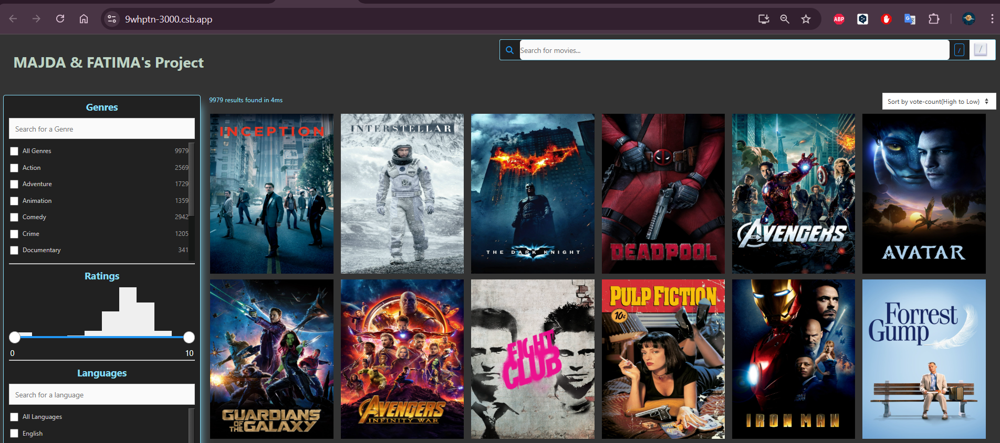

# MovieSearch UI

Welcome to the **MovieSearch UI** project! This guide will help you create a user interface for interacting with the MovieSearch dataset, indexed in an Appbase app. We’ll leverage **DejaVu**, a user-friendly UI for Elasticsearch, to explore and manage the dataset.


## Getting Started

1. Clone the repository or navigate to the project folder:
   ```bash
   cd moviesearch
   ```
2. Install the necessary dependencies:
   ```bash
   npm install @appbaseio/reactivesearch
   ```
3. Start the development server:
   ```bash
   npm start
   ```

## Development Flow

1. Initialize the React app.
2. Install required dependencies.
3. Explore the MovieSearch dataset via DejaVu.
4. Develop the UI incrementally, generating code snippets in Codesandbox.io for testing.

## Demonstration

You can test the demo of the MovieSearch UI by clicking on the image below:



[Click here to try the MovieSearch UI](https://9whptn-3000.csb.app/)

---

Make sure to add the `demo.png` image file to your project directory so that it appears correctly in the README.

## Utilizing DejaVu for Elasticsearch

DejaVu provides a comprehensive UI for navigating and managing your indexed MovieSearch dataset. It simplifies interacting with Elasticsearch data and enhances the development process.

---

Feel free to reach out if you have any questions or need help along the way. Happy coding! 🚀

---
